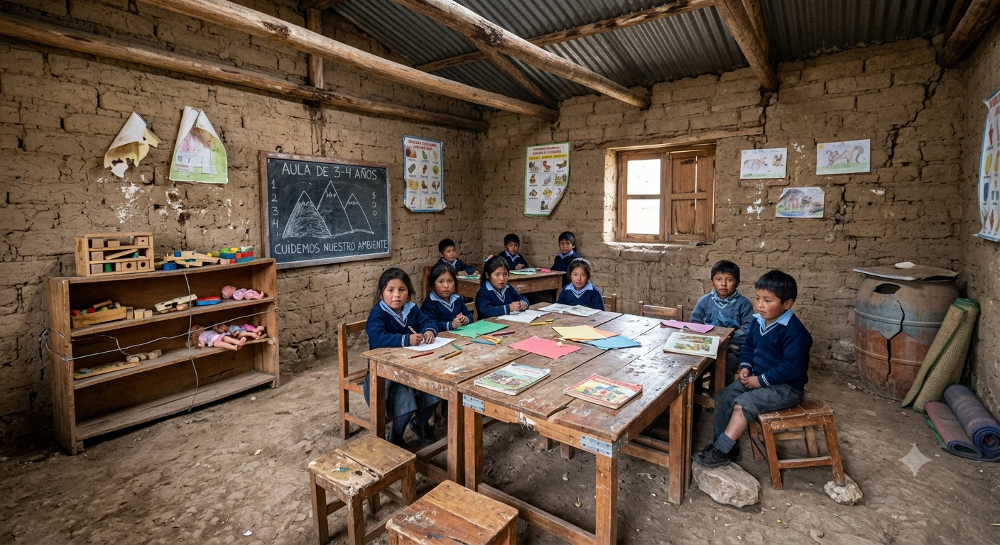
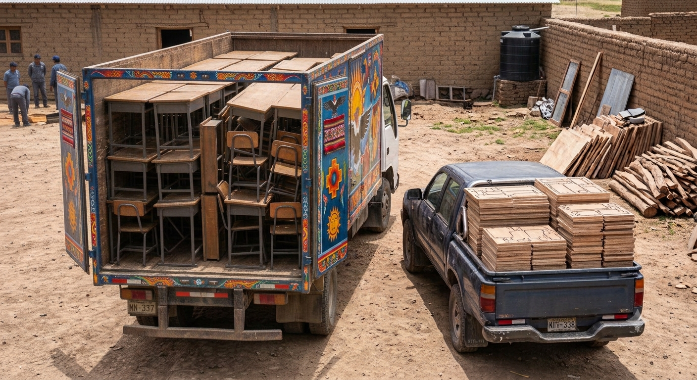

---
hide:
    - toc
---

# Proyecto Integrador

## **1. Problema o pregunta de trabajo.**

Este proyecto busca ayudar con la problemática de la falta de mobiliario adecuado para niños de escuelas públicas en zonas de bajos recursos económicos y de dificl acceso en nuestro país.

Resulta importante poder contar con infraestructura adecuada ya que los niños en etapa escolar pasan en promedio 5 horas diarias en el aula. Un mobiliario adecuado en tamaño puede influir positivamwente en el desarrollo del aprendizaje durante este periodo de tiempo, ya que le permite al niño sentirse mas cómodo y a gusto desarrollando sus actividades. Adenás de contribuir en su desarrollo físico ayudandolo a manteber una postura adecuada.

El Perú cuenta con zonas geográficas de difícil acceso y muchas comunidades se encuentran alejadas de las ciudades y sin vias de comunicación adecuadas. Siendo el acceso de transporte de carga, en muchos casos, muy dificl.
   
    

    

    

Es por esto, que este proyecto busca desarrollar un mobiliario, que aproveche los beneficios de la fabricación digital. Y que me permita poder sortear las limitaciones logísticas que implica el traslado de los mismos y que también sea viable económicamente frente a otras alternativas

Por esto planteo dos ideas para este proyecto, las cuales desarrollo a continuación.

1. Para poder reducir las complicaciones logístcas del traslado, planteo que el mobiliario pueda ser trasladado en piezas y desarmado. Esto permitirá reducir el volumen de la carga impactando positivamente en el fleteo y en el tipo de vehiculo necesario para el traslado.

2. El armado del mobiliario debe ser realizado por miembros de la comunidad, padres, maestros e incluso los propios niños. Para que el ensamblado sea fácil, planteo que el mobiliario pueda contar con la mínima cantidad de piezas posibles. Además el tipo de encastre utilizado debe ser de facil comprensión para que sea sencillo entender el procedimiento de armado del mobiliario. Finalmnente considero importante que el mobiliario pueda ser ensamblado sin utilizar herramientas y ningun tipo de pegamento, perno, tuerca o tornillo.

    

    

Finalmente, ¿Qué es lo que busco con este proyeto?. No busco ofrecer un mueble físico o las piezas ya cortadas. Lo que busco es ofrecer un archivo digital, que pueda ser utilizado por cualquier persona o entidad que este interesada en el desarrollo de este mobiliario para los fines ya establecidos. Y que este desarrollo pueda llevarse a cabo en la localidad más cercana al punto de entrega, que cuente con todas las herramientas e insumos necesarias para su desarrollo, descentralizando asi su fabricación

