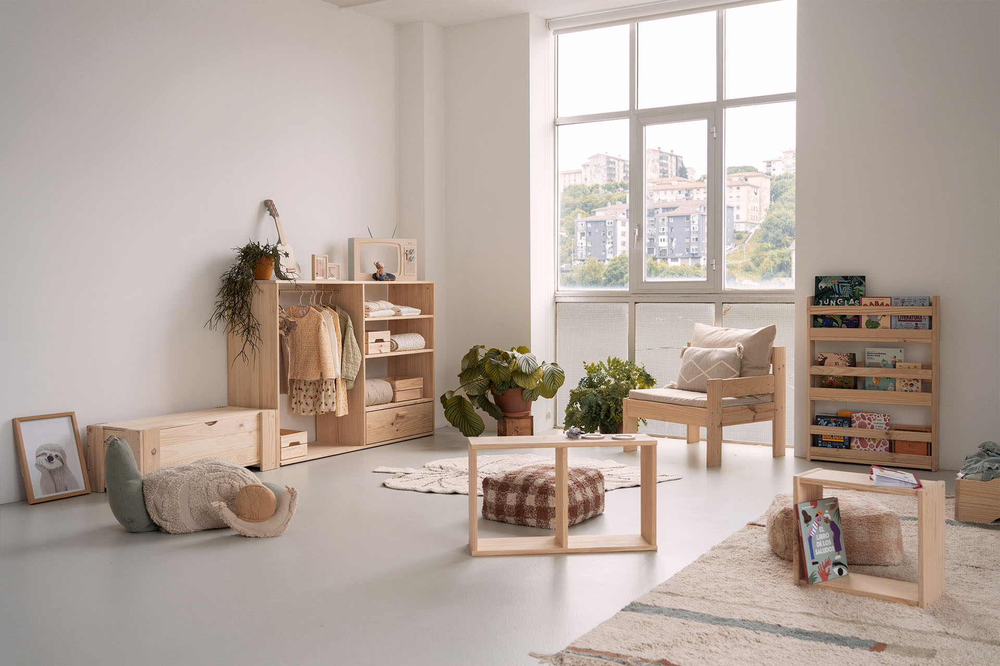
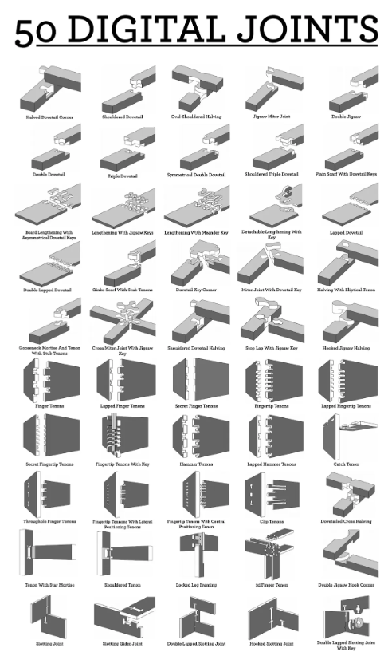
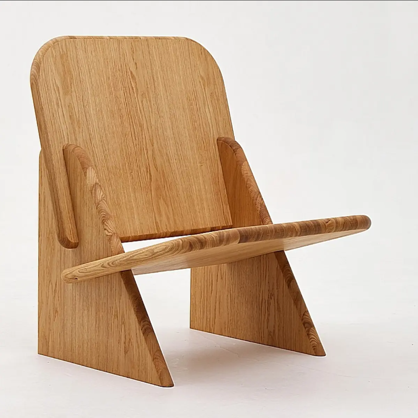

---
hide:
    - toc
---

# Proyecto Integrador

## **2. Marco conceptual y antecedentes.**

Existe mucha información disponible sobre la fabricacion de mobiliario para niños. Durante la recolección de información pude leer acerca del metodo Montessori. Creado por Maria Montessori, este metodo tiene un enfoque educativo que tiene como centro al niño. 

Los muebles fabricados bajo el metodo Montessori, permiten al niño poder desarrollarse en su ambiente de forma natural. Además de fomentar su independencia sin descuidar la seguridad. Todo esto influye positivamente en el desarrollo y crecimiento del menor y refuerza la idea de lo importante que es implementar mobiliario adecuado para esta etapa de formacion y crecimiento.

    

    

Para más información se pueden visitar los siguientes enlaces de algunos fabricantes de muebles Montessori, donde también se explica un poco sobre este metodo y filosofia.

- [**Sillapilable**](https://www.sillapilable.com/que-es-el-mobiliario-montessori/)  

- [**Aserrin**](https://aserrinperu.com/categoria-producto/muebles-montessori/) 

- [**Muba**](https://muba.design/blogs/noticias/que-son-los-muebles-montessori-y-como-contribuyen-al-desarrollo-infantil?srsltid=AfmBOopRwnh7iOJIc9vKRYsb8dXcEdBkeYTI5_of-VQ30EdTMSnEkTQ1) 

- [**Lufe**](https://muebleslufe.com/que-es-un-mueble-montessori?srsltid=AfmBOoojmR02B_UJ1kckMrHmn6EyoWcqIaMOFZQj0AsERbpeZRYe_ZLw) 

Si bien el objetivo principal del proyecto no es desarrollar un mobiliario bajo este metodo, sirve mucho de inspiración para el desarrollo de los diseños y prototipos.

También pude buscar información acerca de los distintos tipos de encastre para madera que pueden fabricarse con procesos digitales. Estos influenciaron en los primeros bocetos que realice. Cada encastre con sus ventajas, y todos disponibles para utilizarlos en el diseño de algunos prototipos. Se puede ver un video sobre ideas de encastres de madera [**aquí**](https://youtu.be/PzTpfLcL1Y8?si=HkGhzUjO4vXRTXHu)  

    

    

Sin embargo, en el camino de busqueda de información pude encontrarme con un diseño que llamo mucho mi atención. Es simple, de pocas piezas y al parecer de fácil fabricación. No tiene encastres elaborados o complejos pero siento que esa simpleza puede contribuir en el proyecto.

    

    

    

El ensamblado es muy simple e intuitivo, además al no contar con encastres muy elaborados, se puede fabricar en menos tiempo y reducir el costo de este proceso. Buscando mas información sobre este tipo silla pude encontrarme con la marca [**Enzzambla.**](https://www.enzzambla.com/?srsltid=AfmBOopOF-tWpGo_CulXKBFdWRmbXgRGklpH3TE-zsAImrhnBDXbaqSU)  que es la que más se asemeja a lo que el proyecto busca desarrollar.

Ya con una idea más clara sobre el diseño de los mobiliarios, me hace mas sentido y pienso que la herramienta más adecuada para llevar a cabo el prototipo es una máquina de corte CNC.