---
hide:
    - toc
---

# MT01

## **Crear usuario en GitHub**
GitHub es la plataforma que me ayudará a compartir en linea los avances del curso.

Para empezar a usar la plataforma necesito crear una cuenta en www.github.com.
 
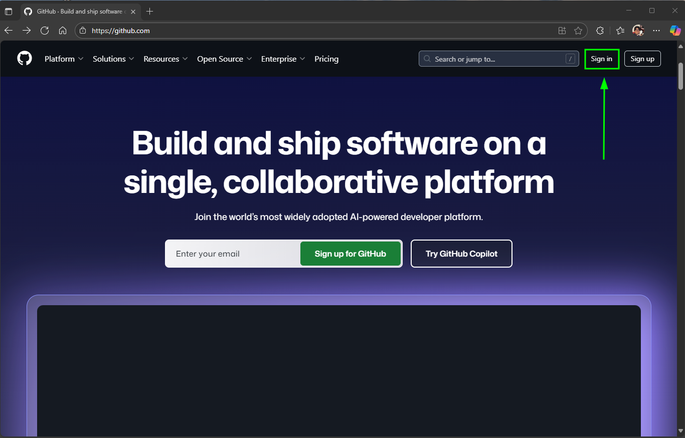
<br>
## **Descargar e instalar software**

Para este curso voy a utilizar el sistema operativo Windows 11.

El software requerido para este módulo es el siguiente:

- **Git** → [Descargar Git](https://git-scm.com)  
- **Python 3** → [Descargar Python](https://www.python.org)  
Por algún motivo a mi no me funcionó el Python instalado desde la página web. Buscando soluciones en internet, encontré la sugerencia de instalarlo desde el Windows Store y finalmente funcionó.
- **Visual Studio Code** → [Descargar Visual Studio Code](https://code.visualstudio.com/)  

<br>

Para instalar Git, le doy click en "Downloads" y elijo el sistema operativo.

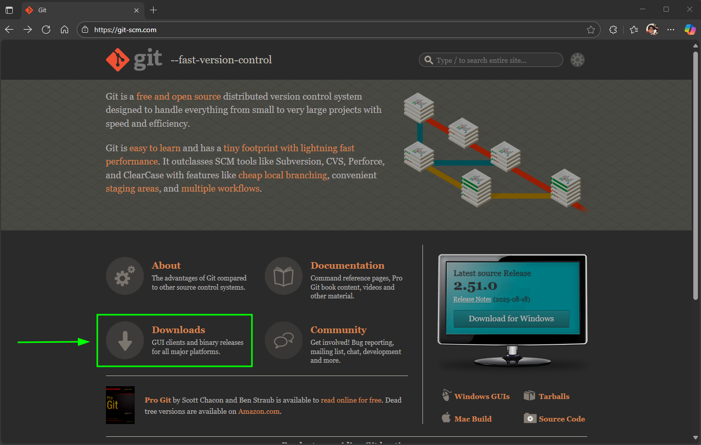

<br>

Para instalar Python desde la web, le doy click en "Downloads" y elijo el sistema operativo.

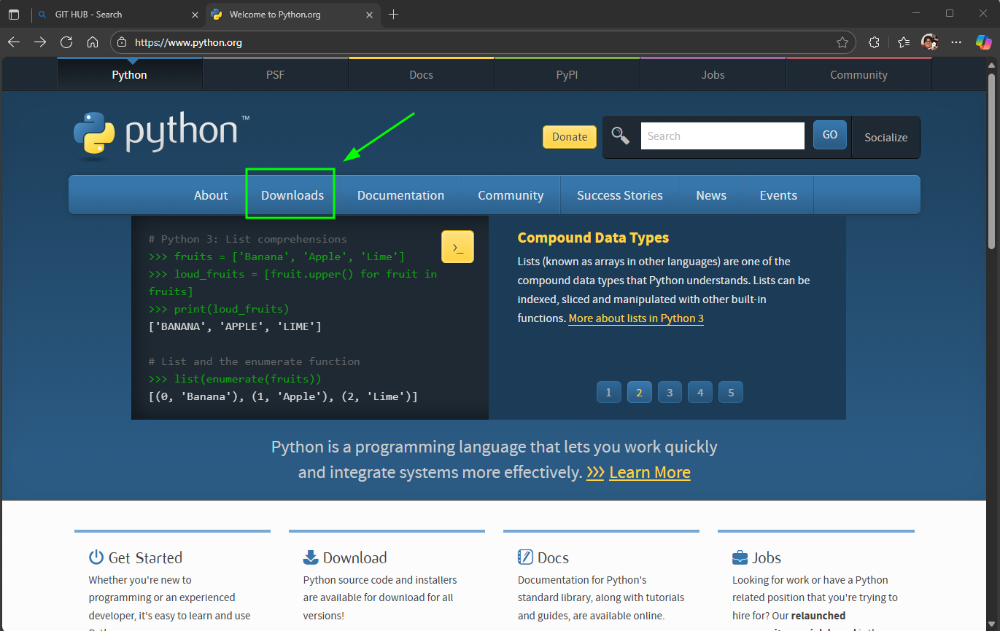

<br>
Para instalar Python desde el Windows store, abro la aplicación, busco "Python" e instalo.

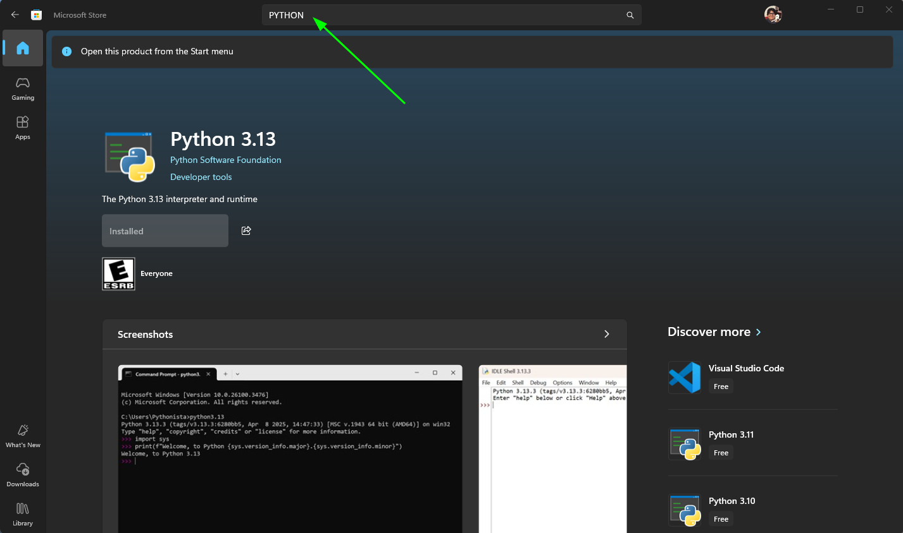

<br>

Para instalar Visual Studio Code, le doy click en "Download" y elijo el sistema operativo. También puedo darle click directo al botón "Download for Windows", donde la página web ya detectó el sistema operativo utilizado.

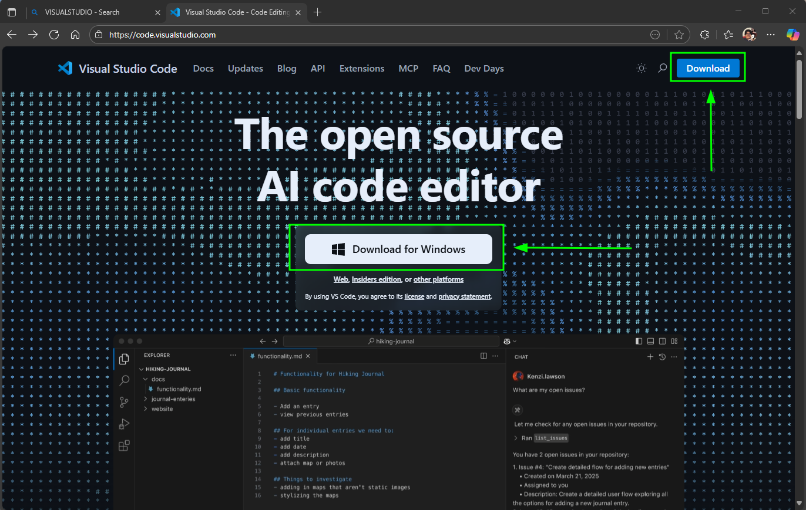
<br>

## **Instalar extensiones en Visual Studio Code**

Una vez instalado Visual Studio Code, instalo las siguientes extensiones.

**Markdown Preview.** Esta extensión me permitirá tener una vista previa del código en forma visual.

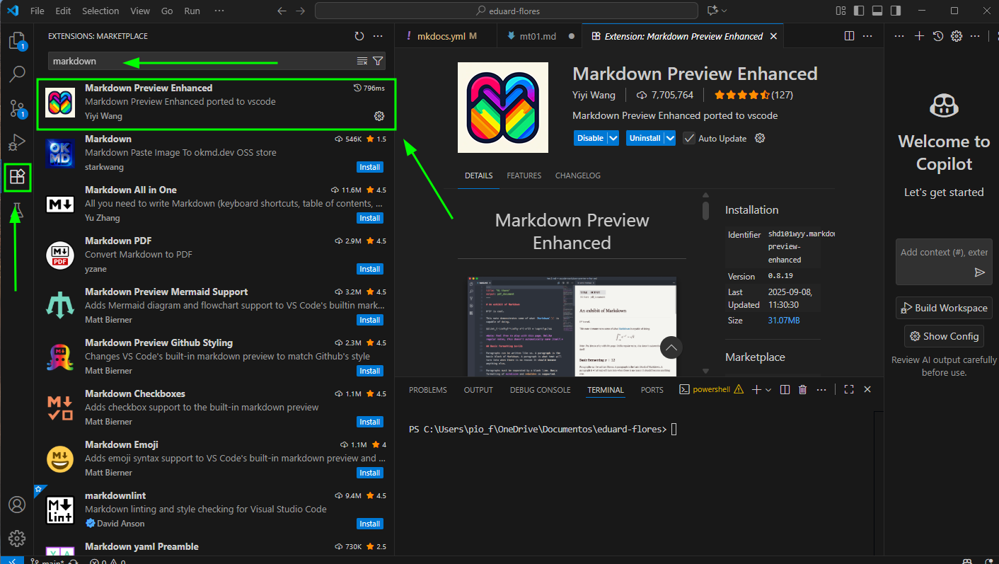

**Phyton.** Estas extensiones me permitirán trabajar con Python dentro de Visual Studio Code. (Verificar que el autor de las extensiones sea Microsoft)

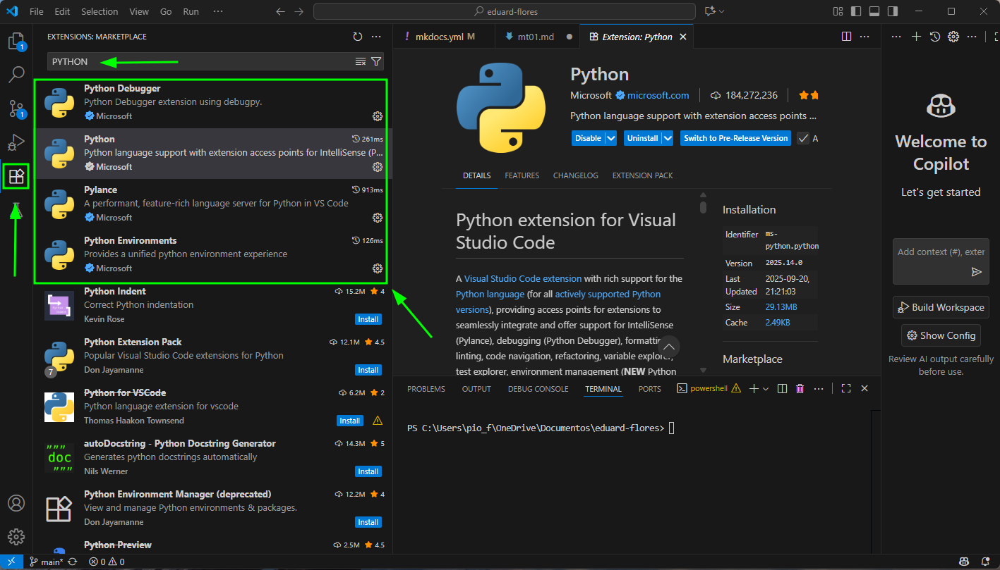
<br>
Para verificar que todo está correctamente instalado, en el terminal de Visual Studio Code, ingreso los siguientes comandos:

```bash
git --version
python --version
```

Y se deben mostrar las versiones de cada uno.

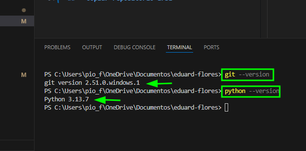
<br>

## **Copiar repositorio EFDI**

Para crear mi página web, voy a usar el template ya desarrollado por EFDI. Inicio sesión en GitHub y accedo al siguiente enlace donde se encuentra el template:

https://github.com/fablabbcn/efdi-template

Hago click en "Fork" para poder copiar el repositorio

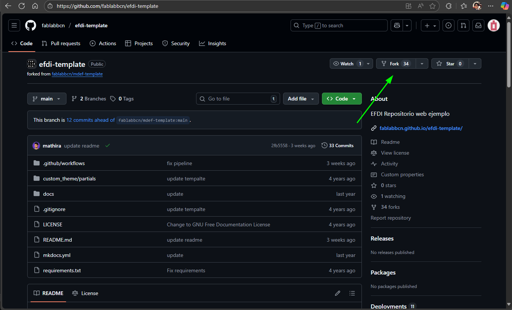

Luego reemplazo el nombre del repositorio "efdi-template" por mi nombre, en este caso voy a usar "eduard-flores". Para finalizar hago click en "Create Fork". Con esto ya tengo creado mi repositorio.

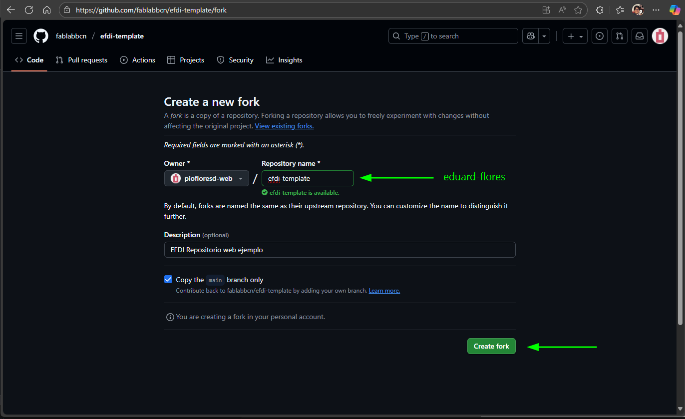

Ahora empiezo a personalizar algunos archivos.

En la pestaña "Code", en la parte inferior derecha de la pantalla, le doy click al lápiz para modificar el archivo README.md

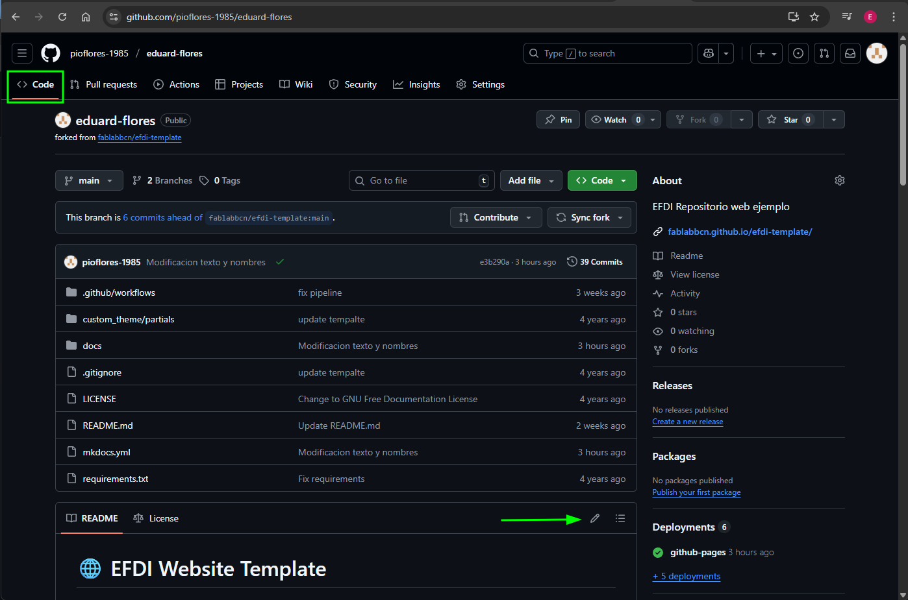

En la parte final del archivo voy a reemplazar la palabra "fablabbcn" por mi nombre de usuario (Puedo encontrarlo en la barra de direcciones) que es "pioflores-1985" y reemplazo la palabra "efdi-template" por el nombre del repositorio (Puedo encontrarlo en la barra de direcciones) que es "eduard-flores"

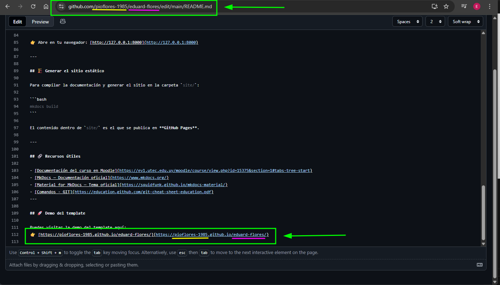

Finalmente le doy click al botón "Commit changes" para grabar las modificaciones.

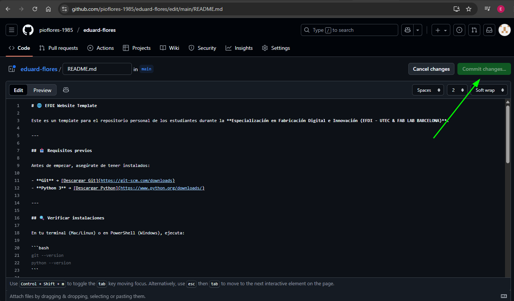

Ahora voy a la pestaña "Setings" y hago click en "Pages". En la sección "Branch", reemplazo "none" por "gh_pages" y le doy click en el botón "Save" para guardar los cambios.


En la pestaña "Code", abro el archivo mkdocs.yml

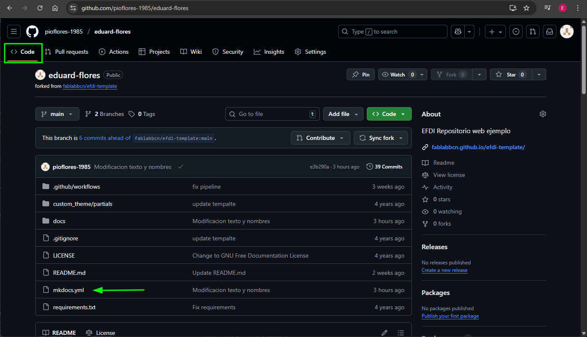

Le doy click en el lápiz para editar el archivo.

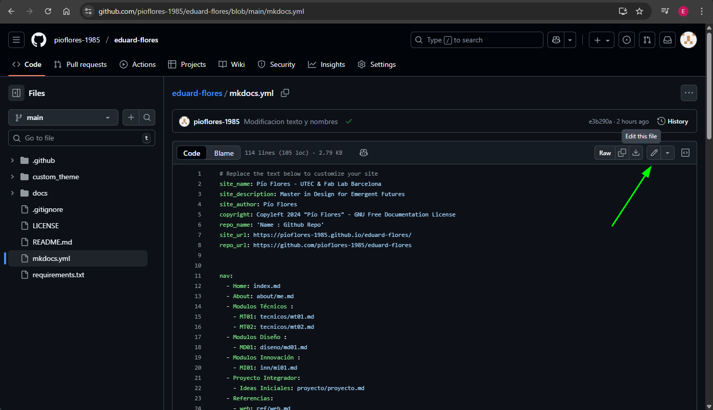

En las lineas 7 y 8 del archivo voy a reemplazar la palabra "fablabbcn" por mi nombre de usuario (Puedo encontrarlo en la barra de direcciones y en la parte superior izquierda de la pantalla) que es "pioflores-1985" y reemplazo la palabra "efdi-template" por el nombre del repositorio (Puedo encontrarlo en la barra de direcciones y en la parte superior izquierda de la pantalla) que es "eduard-flores"

La linea 7 ya modificada sera la dirección la página web. (https://pioflores-1985.github.io/eduard-flores/)

Finalmente hago click en el botón "Commit changes" para guardar las modificaciones"

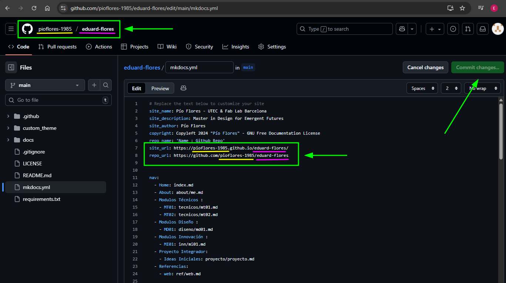

## **Crear clave SSH**

Para crear la clave SSH, abro Terminal de Windows e ingreso el siguiente comando, reemplazando "tu_mail" por mi correo electrónico "pio.flores@gmail.com"

```bash
ssh-keygen -t rsa -C "tu_mail"
```

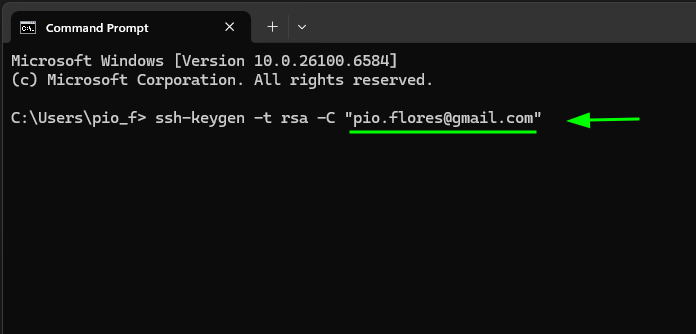

Presiono Enter un par de veces hasta obtener la siguiente pantalla. Aquí puedo encontrar la ruta del archivo ".pub" que he generado.

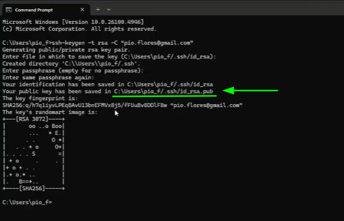

Busco el archivo "id_rsa.pub" utilizando la ruta anterior.

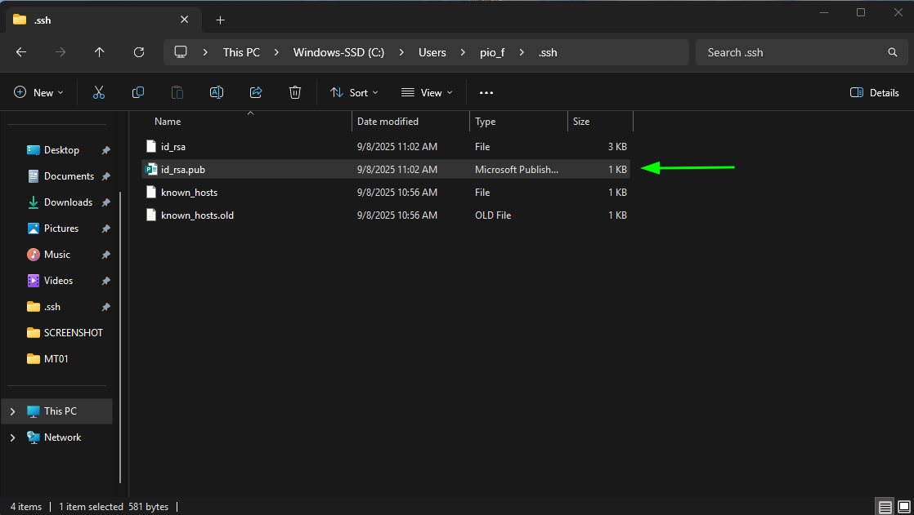

Abro el archivo "id_rsa.pub" con el block de notas (Click derecho, Abrir con, Block de notas) . Esta es mi clave SSH. Verifico al final del texto que incluya mi correo electronico. Copio el contenido del texto para insertarlo en GitHub,

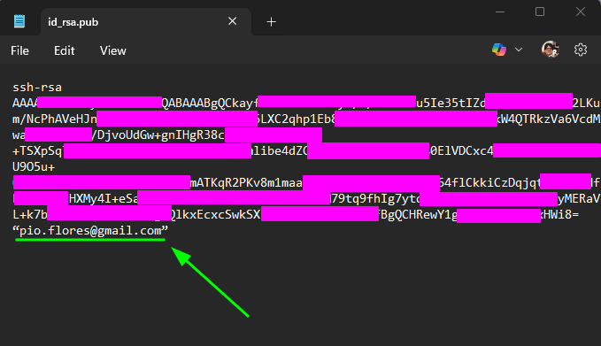

En GitHub, le doy click a la foto de mi perfil y click en "Settings"

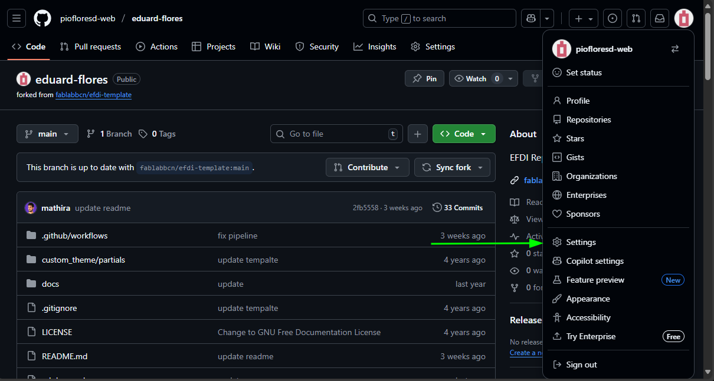

En la barra lateral izquierda le doy click a "SSH and GPG keys" y luego click en el boton "New SSH key"

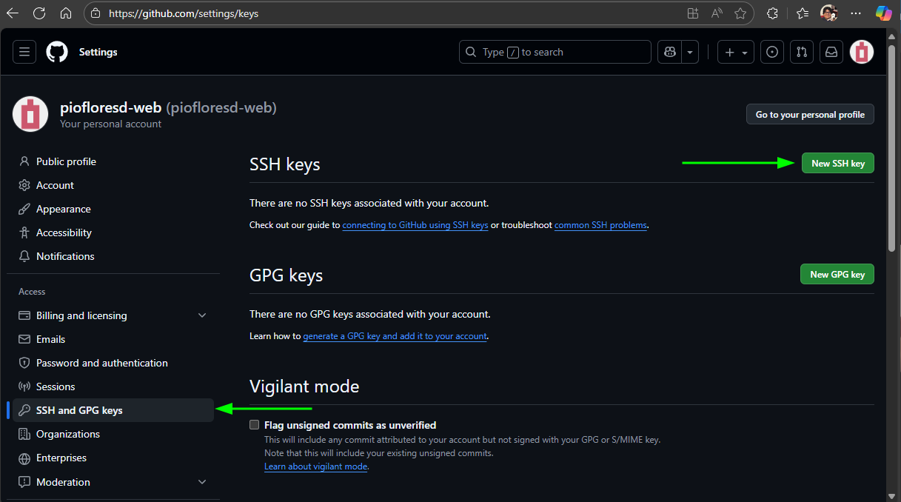

En el cuadro de texto "Key" copio el contenido del texto del archivo "id_rsa.pub" que habia abierto anteriormente con el Block de notas. Le doy click en el botón "Add SSH key" para agregar la clave SSH.

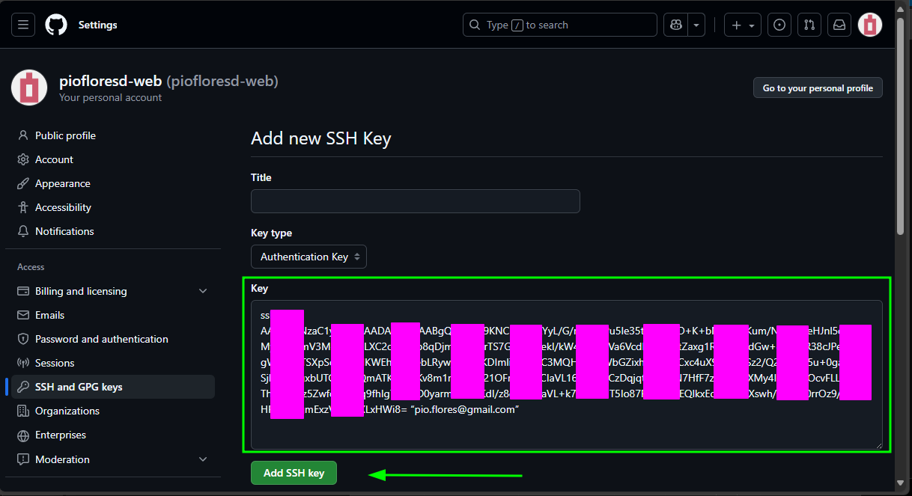

En esta pantalla ya puedo ver la clave SSH que acabo de agregar.

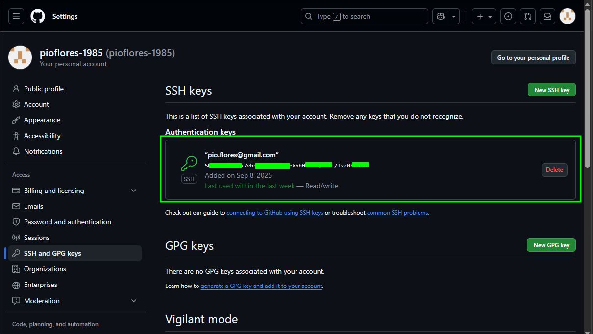


