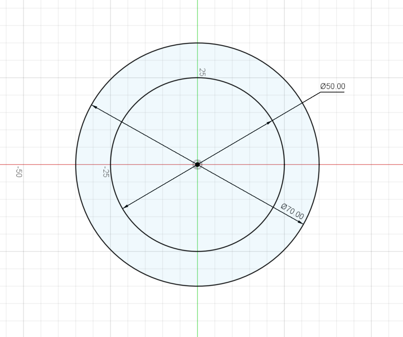
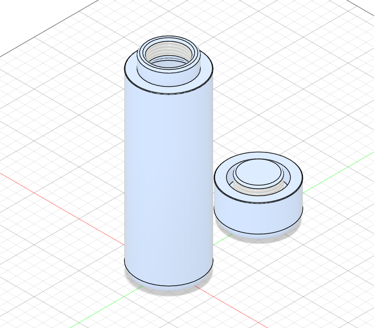
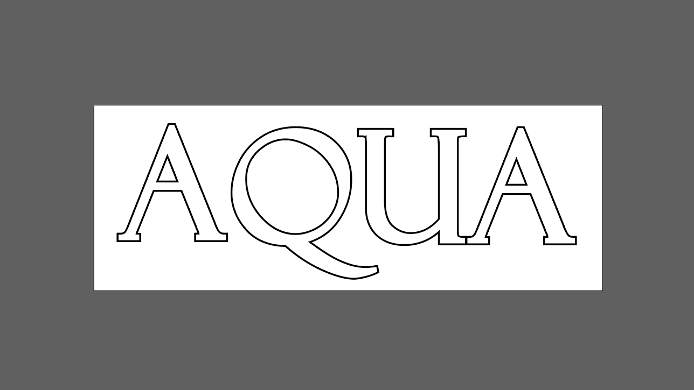
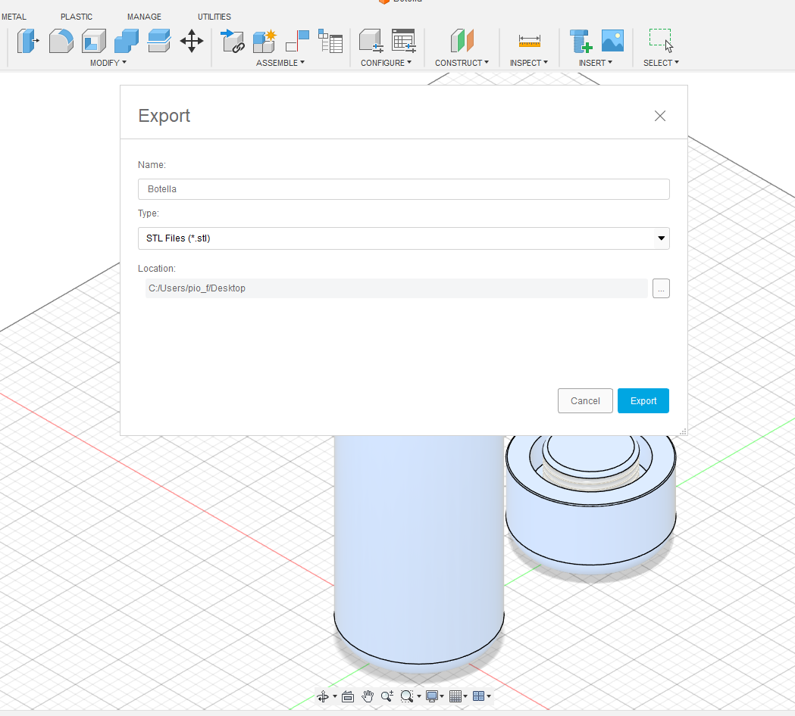
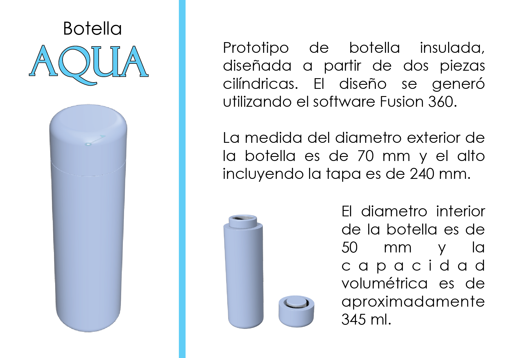

---
hide:
    - toc
---

# MT02

## **Boceto inicial**
Empiezo generando algunos bocetos a mano alzada, mejorando cada vez el anterior, hasta llegar a un boceto que se acerca bastante al prototipo que quiero diseñar.

Teniendo medidas y formas de referencia, empiezo a trasladar esa idea a Fusion 360.
 

Bocetos iniciales.
 

 

## **Creando diseño en Fusion 360**
Empiezo dibujando el sketch de la botella. Al empezar a extruir el sketch, voy modificando sobre la marcha el diseño de los bocetos y agregando partes cilíndricas hasta obtener la forma final de la botella.

De la misma manera genero el diseño de la tapa. Empiezo con un sketch y voy extruyendo.

Finalmente agrego una rosca a la botella y la tapa. Obteniendo asi mi prototipo.
 

Dibujo sketch inicial de base de la botella.
 

 

Dibujo sketch inicial de la tapa de la botella.

 

Dibujo sketch final.

 

Ya con el diseño final, resultado de la extrusión de ambos sketch, procedo a redondear la parte superior de la tapa y la parte inferior de la botella. También redondeo la parte interior de la botella. Finalmente redondeo ligeramente la parte del pico de la botella y otras partes para wue sean mas amigables con el usuario. 
 

Diseño final.

 

 

## **Creación de Logo**
Para el diseño del logo, utilizo Adobe Ilustrator. Genero el texto "AQUA" con el tipo de letra Felix Titling. Luego convierto este texto a una imagen vectorial que me permita manipularlo.

Finalmente lo exporto como archivo SVG para poder agregarlo a mi prototipo desarrollado en Fusion 360.
 

Logo AQUA.
 

 

## **Diseño final**
Para finalizar con el diseño, inserto el archivo SVG del logo pero no puedo agregarlo correctamente en la superficie de la botella. Luego de algunos intentos decido continuar sin este.

Exporto mi archivo al formato STL desde Fusion 360.

 

Creando archivo STL.
 

 

<a href="../Botella.stl"> Descargar archivo STL </a>

 

 

## **Lámina**
 

