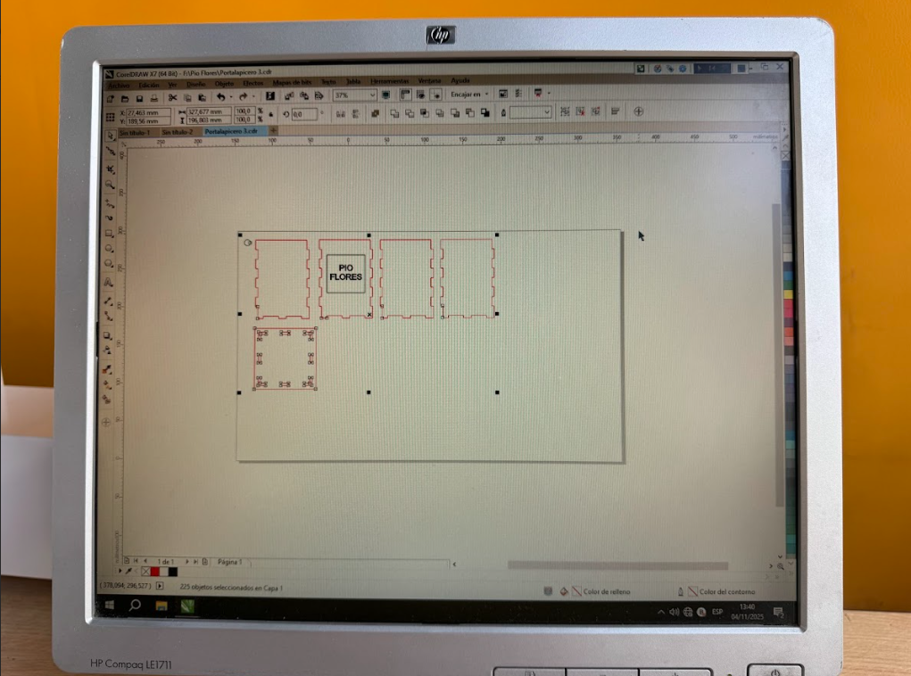
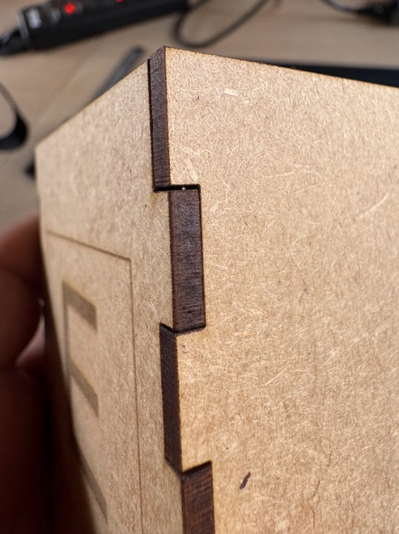
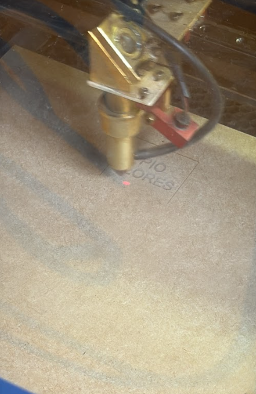

---
hide:
    - toc
---

# MT03

## **Idea Inicial**
Para este proyecto, decido fabricar un porta lapiceros rectangular de 7x7x10 cm. Al ser mi primera experiencia con diseño y corte laser, no utilizaré superficies redondeadas. Las piezas serán rectas y los encastres seran simples.
 

## **Primer sketch**
El diseño del porta lapiceros estará compuesto de 5 piezas. 4 caras que conformarán el cuerpo principal y una base que servira tambien para darle rigidez al diseño. Luego de muchos dinujos en papel y en autodesk, obtengo el siguiente sketch.
 

Primer Sketch.
 

 

Proyeccion en 3D.
 

 

## **Creación de archivo DXF**
Para crear el archivo DXF doy click en el menú superior: File, Export (Archivo, Exportar).

En la siguiente ventana nombro el archivo y elijo la opcion de archivo DXF.

Ya con esto tengo listo el archivo para utilizarlo en la maquina de corte laser. (Este archivo esta adjuntado al final de esta página).
 

Crear archivo DXF.
 

 

## **Trabajo en laboratorio - Corte # 1**
En el FabLAB de ESAN, tengo disponible la maquina de corte laser AVR - 1400, que trabaja con el software CorelDraw X7.

Inicialmente no pude utilizar el archivo DXF que prepare anteriormente. Por recomendación de el jefe de laboratorio, converti el archivo DXF a PDF utilizando Adobe Ilustrator. Finalmente ya pude visualizar mi diseño en CorelDraw.

CorelDraw no pudo reconocer mis lineas para rasterizado, asi que procedi a eliminarlas y añadí un texto con la letra E directamente en CorelDraw. Tambien añadí un punto guia en la parte superior izquierda para referencia. Ya con estas últimas modificaciónes procedo a relizar el corte con los siguientes parametros.

**Corte:**  
Potencia: 75%  
Velocidad 20%  
Grosor de linea: Muy fino  

**Gravado:**  
Potencia: 15%  
Velocidad: 200 mm/s  
Grosor de linea: 0.5 - 0.75  

Archivo en CorelDraw.
 

 

Maquina Laser.
 

 

Proceso de corte y rasterizado.
 

 

<u>Resultados:</u> 
Obtuve piezas que no encajaban bien ya que no tuve en cuenta el desgaste del material que produce el laser.

Ensamblado.
 

 

Detalle de la tolerancia en el encastre.
 

 

## **Trabajo en laboratorio - Corte # 2**
Luego de realizar mediciones en las piezas cortadas, pude determinar que el laser genera un desgaste de 0.2 mm. Ajusto nuevamente el diseño en Autodesk y genero un archivo DXF y un Archivo PDF que pueda abrir en la maquina de la cortadora laser.

Para este segundo diseño reemplace la letra E por mi nombre "Pio Flores" para poder diferenciar ambos diseños.

Nuevo archivo en CorelDraw.
 

 

Segundo proceso de corte y rasterizado.
 

 

<u>Resultados:</u> 
En este segundo diseño, las piezas encajan perfectamente y se sostienen por si mismas.

Ensamblado de segundo diseño.
 

 

 

con esto damos por finalizado el proyecto y nos quedamos con el segundo diseño. 

a continunacion adjunto los archivos utilizados:

<a href="../portalapicero2-1.dxf"> Descargar archivo DXF </a>

<a href="../portalapicero3.pdf"> Descargar archivo PDF </a>