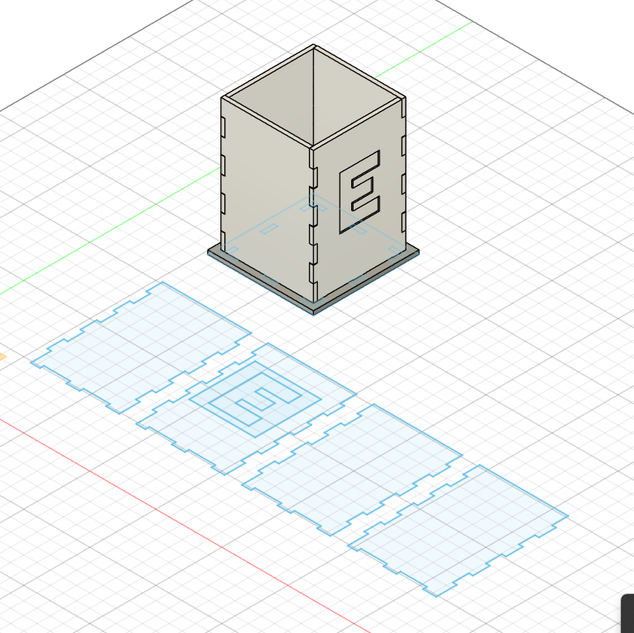

---
hide:
    - toc
---

# MT03

## **Idea Inicial**
Para este proyecto, decido fabricar un porta lapiceros rectangular de 7x7x10 cm. Al ser mi primera experiencia con diseño y corte laser, no utilizaré superficies redondeadas. Las piezas serán rectas y los encastres seran simples.
 

## **Primer sketch**
El diseño del porta lapiceros estará compuesto de 5 piezas. 4 caras que conformarán el cuerpo principal y una base que servira tambien para darle rigidez al diseño. Luego de muchos dinujos en papel y en autodesk, obtengo el siguiente sketch.
 

Primer Sketch.
 

 

Proyeccion en 3D.
 

 

## **Creación de archivo DXF**
Para crear el archivo DXF doy click en el menú superior: File, Export (Archivo, Exportar).

En la siguiente ventana nombro el archivo y elijo la opcion de archivo DXF.

Ya con esto tengo listo el archivo para utilizarlo en la maquina de corte laser. (Este archivo esta adjuntado al final de esta página).
 

Crear archivo DXF.
 

 
