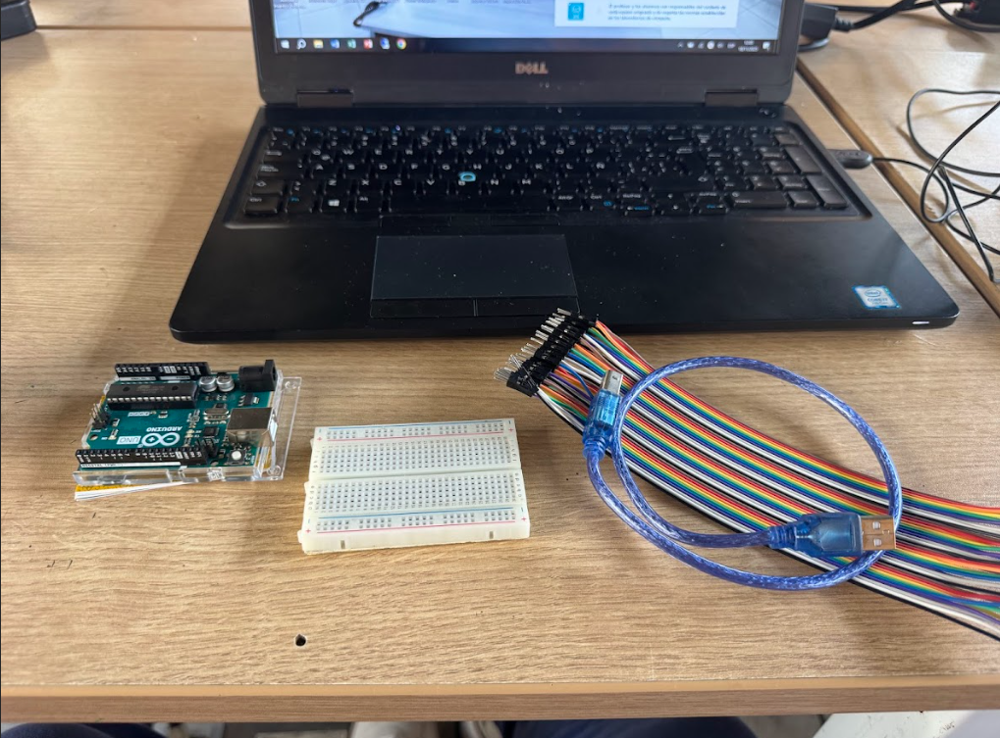
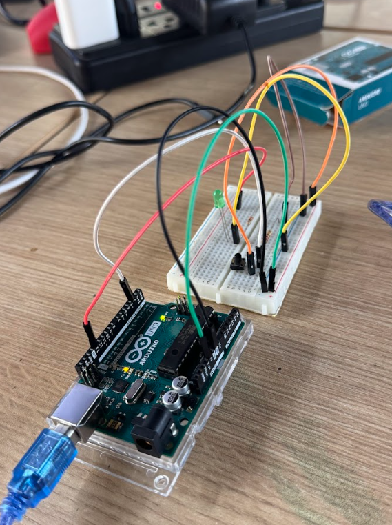
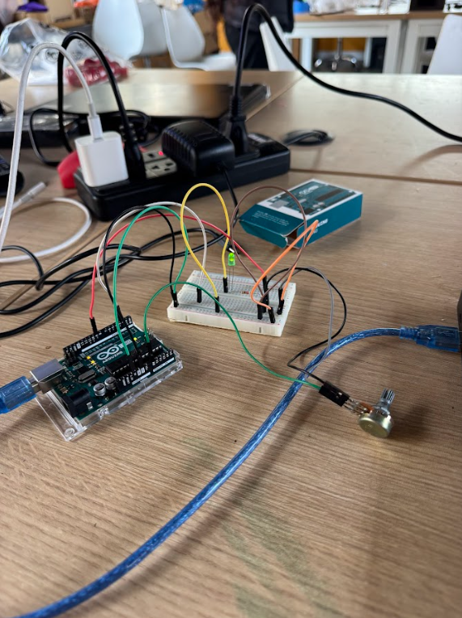
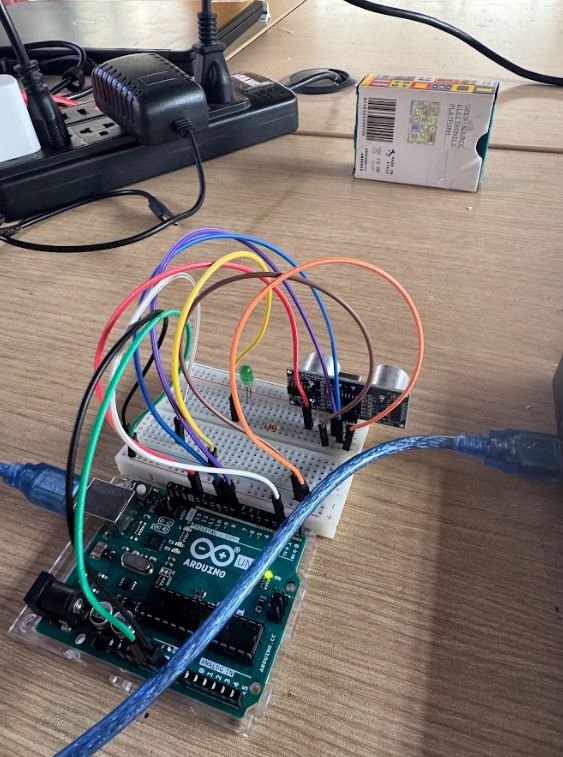

---
hide:
    - toc
---

# MT04

## **PrÁctica presencial Arduino**
La siguiente practica se realizo en el laboratorio del Fab Lab de ESAN, en Lima. Utilice un Kit de Arduino proporcionado por ESAN y una computadora con el Software ya instalado.
 

Equipos FabLab ESAN.
 

 
 

 

## **Ejercicio 1**
Programar el Arduino para que lea un botón y encienda un LED únicamente mientras el botón esta presionado.

Cuando el botón se suelta, el LED debe apagarse.
 

Código.
 

 

Conexión en Arduino.
 

 

## **Ejercicio 2**
Programar el Arduino para que lea el valor de un potenciómetro y controle el brillo de un LED.

Cuando el potenciómetro esté en valores bajos, el LED debe estar tenue. Cuando el potenciómetro esté en valores altos, el LED debe brillar más fuerte.

El cambio debe ser progresivo: a mayor giro del potenciómetro mayor brillo.

 

Código.
 

 

Conexión en Arduino.
 

 

## **Ejercicio 3**
Programar el Arduino para que use el sensor de distancia SRF05 y encienda un LED cuando un objeto esté a menos de 20 cm.

Si el objeto está más lejos, el LED debe permanecer apagado.

Además, el programa debe mostrar en el Monitor Serie la distancia medida en centímetros.
 

Código.
 

 

 

Conexión en Arduino.
 

 

